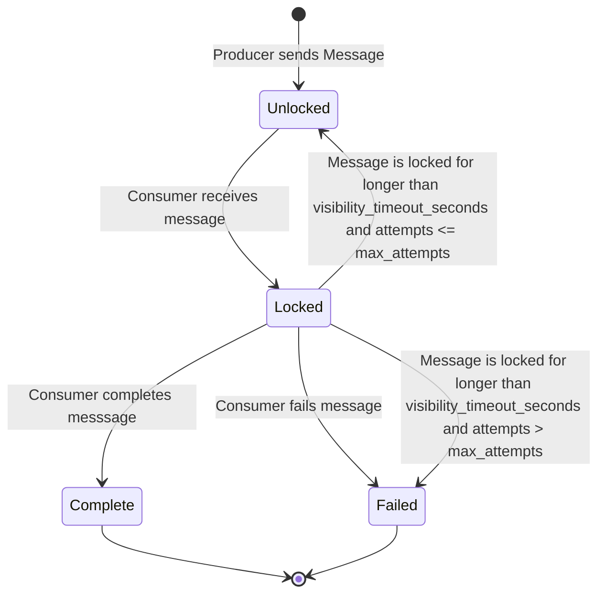

# hq

[](https://github.com/ckampfe/hq/actions/workflows/rust.yml)

---

## what

hq is a multi-producer multi-consumer message queue, similar [SQS](https://aws.amazon.com/sqs/), but targeted at use cases where SQS might be overkill or where you can't access it, like on low-powered or embedded devices, or where you have low message volume.

It can run with an on-disk or in-memory SQLite database if you don't need persistence.

## message and queue model

Messages are the unit of communication between producers and consumers.
Queues are ordered lists of messages.
Consumers dequeue messages in the order producers sent them to the queue.
There can be many queues.

When a producer sends a message, it goes into a queue until a consumer receives it.

When a consumer receives a message, the message is locked and cannot be seen by other consumers for the queue's configured `visibility_timeout_seconds`. After `visibility_timeout_seconds`, the message is visible to and receivable by consumers.

If the consumer completes the message before `visibility_timeout_seconds`, the message is marked as completed and can no longer be seen by consumers.

If the consumer fails the message, the message can no longer be seen by consumers.

If a message is locked more than the queue's configured `max_attempts`, the message is failed.




## API

It's an HTTP API so you can write your own client in your favorite language.
Paramters for creation are not optional.
Paramters for update are optional.

This is an partial API description.
For the whole API see the Rust client in `client`.

```
Return values are "happy" cases. Everything can error.

POST "/queues/{name}/enqueue" with JSON body
    returns JSON `{"messages_id" -> uuid}`

GET "/queues/{name}/receive"
    returns optional JSON `{ id: string uuid, args: json, queue: string, attempts: integer }`

GET "/queues/{name}"
    returns optional JSON `{name: string, max_attempts: integer, visibility_timeout_seconds: integer}`

PUT "/queues/{name}?max_attempts=integer&visibility_timeout_seconds=integer"
    returns ()

DELETE "/queues/{name}"
    returns ()

GET "/queues"
    returns JSON [{"name": string, "max_attempts": integer}]

POST "/queues?name=string&max_attempts=integer&visibility_timeout_seconds=integer"
    returns ()

PUT "/messages/{id}/complete"
    returns ()

PUT "/messages/{id}/fail"
    returns ()
```