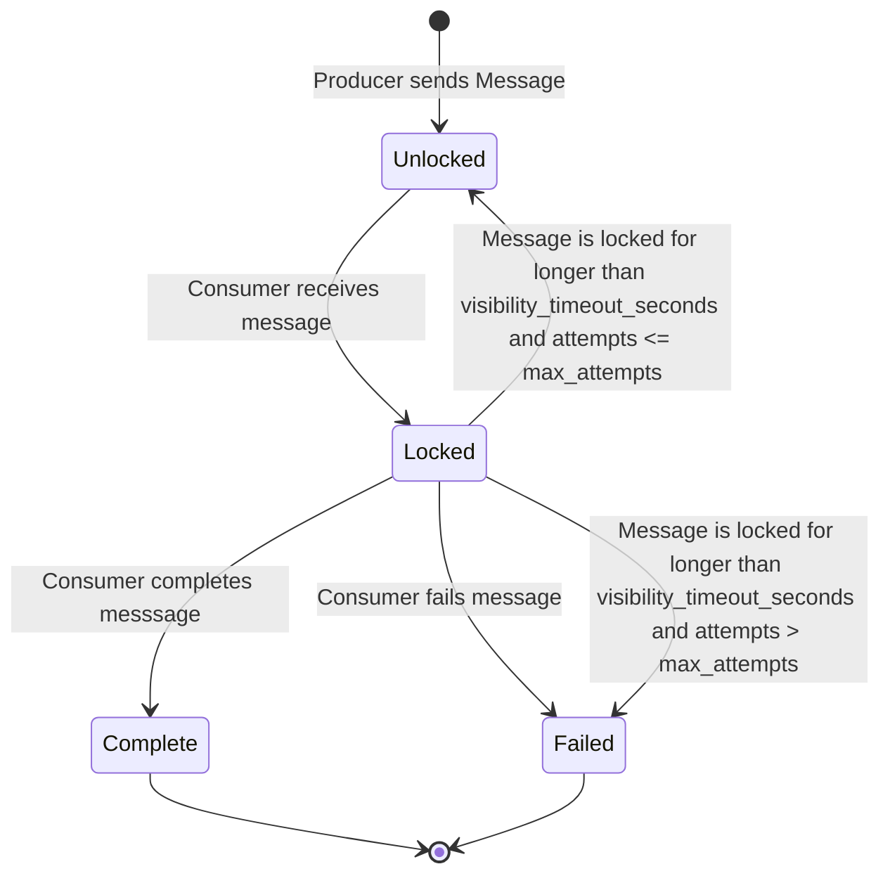

# hq

[](https://github.com/ckampfe/hq/actions/workflows/rust.yml)

---

## what

hq is a multi-producer multi-consumer message/job queue with an HTTP interface.

It is vaguely similar in interface and semantics to AWS [SQS](https://aws.amazon.com/sqs/).

The interface is HTTP, so you can use use any language as a client.

hq is targeted at use cases where:
- you want something you can totally understand, top to bottom
- you do not need SQS's durability/availability/performance/scale guarantees
- you want restart durability
- your application cannot reach the internet and you need to run a message/job queue yourself
- you want to run your message/job queue on the same node as your worker(s)
- you want to run your message/job queue on a different node than your worker(s)
- you want to use a language of your choice to communicate with your message/job queue over HTTP
- you want a message/job queue to run on limited hardware

hq is _not_ targeted at use cases where:
- you need SQS's durability/availability/performance/scale guarantees
- you want the transactional semantics that come from having your message/job queue database being the same as your application database (e.g., Sidekiq, Oban, etc.)
 
## operational model

- Messages are the unit of communication
- A queue is an ordered list of messages
- There can be arbitrarily many queues
- When a producer sends a message, it goes into a queue until a consumer receives it
- When a consumer receives a message, the message is locked and cannot be seen by other consumers for the queue's configured `visibility_timeout_seconds`
- After `visibility_timeout_seconds`, the message becomes visible to and receivable by consumers
- If the consumer completes the message before `visibility_timeout_seconds`, the message is marked as completed and can no longer be seen by consumers
- Receiving a message increments its `attempts`
- A queue has a configured number of `max_attempts`
- If a message's `attempts` exceeds its queue's configured `max_attempts`, the message is marked as failed and it can no longer be received
- Consumers can fail a message proactively, if they are the consumer that has received it
 


## Building the server

```
$ cargo build --release
```

## Running the server

```
./target/release/server
```

## Options

```
$ ./target/release/server -h
Usage: server [OPTIONS] --database <DATABASE>

Options:
  -p, --port <PORT>
          the port to bind the server to [env: PORT=] [default: 9999]
  -r, --request-timeout <REQUEST_TIMEOUT>
          the maximum request timeout, in seconds [env: REQUEST_TIMEOUT=]
  -d, --database <DATABASE>
          the database path. pass `:memory:` to run with an in-memory database [env: DATABASE=]
  -h, --help
          Print help
```


## API

hq is an HTTP API so you can write your own client in your favorite language.
When creating a queue or message, all parameters are required.
When updating a queue, parameters are optional.

This is an partial API description.
For the whole API see the Rust client in `client`.
I haven't yet found an easy way to do a swagger/openapi description in Rust.

```
Return values are "happy" cases. Everything can error.

// enqueue a message
POST "/queues/{name}/enqueue" with JSON body
    returns JSON `{"messages_id" -> uuid}`

// receive a message
GET "/queues/{name}/receive"
    returns optional JSON `{ id: string uuid, args: json, queue: string, attempts: integer }`

// complete a message
PUT "/messages/{id}/complete"
    returns ()

// fail a message
PUT "/messages/{id}/fail"
    returns ()

// get queue metadata
GET "/queues/{name}"
    returns optional JSON `{name: string, max_attempts: integer, visibility_timeout_seconds: integer}`

// update queue options
PUT "/queues/{name}?max_attempts=integer&visibility_timeout_seconds=integer"
    returns ()

// delete a queue and all of its messages
DELETE "/queues/{name}"
    returns ()

// get a list of all queues and their metadata
GET "/queues"
    returns JSON [{"name": string, "max_attempts": integer}]

// create a queue
POST "/queues?name=string&max_attempts=integer&visibility_timeout_seconds=integer"
    returns ()
```

## Performance

Right now, unknown.

## Testing

The Rust client currently serves as integration tests for the server and the client.
